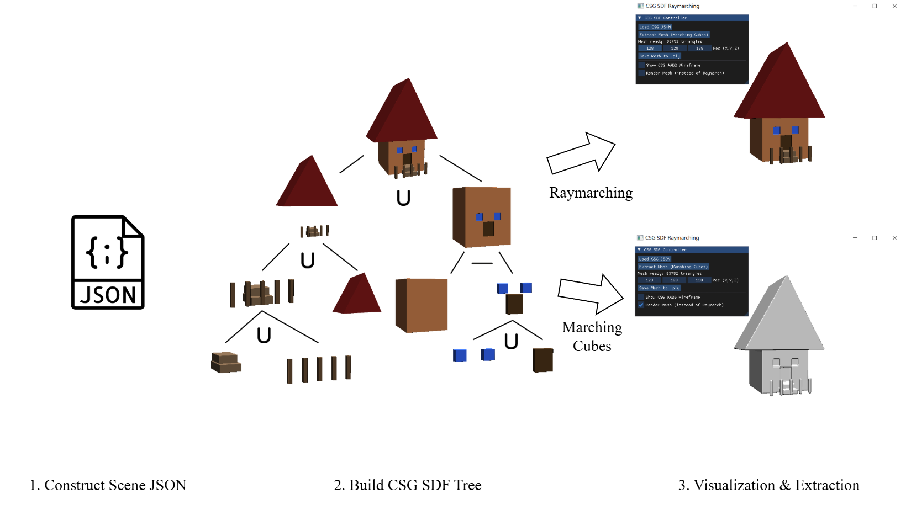

# SDFBooleanEngine
This is a project for learning Constructive Solid Geometry (CSG)

## Usage
For basic usage, you can refer to [basic usage document](docs/basic_usage.md) to create your own 3D assets!

For advanced usage, you can refer to [advanced usage document](docs/advanced_usage.md) to create your own 3D assets!

## Features
- [x] A CSG SDF Tree viewer
- [x] Marching Cube to extract mesh from CSG SDF Tree

## TODO
- [ ] Add more primitives to model complex shapes

## Acknowledgements
This repo benifits from [Inigo Quilez ](https://iquilezles.org/articles/distfunctions/), [glm](https://github.com/icaven/glm), [glfw](https://github.com/glfw/glfw), [glad](https://github.com/Dav1dde/glad), [imgui](https://github.com/ocornut/imgui)
, [json](https://github.com/nlohmann/json). Thanks for their great work!