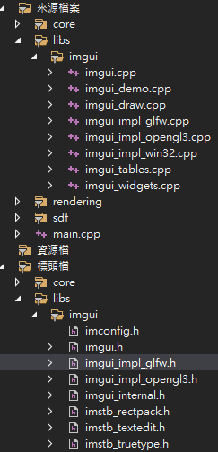
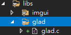
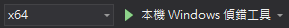

# Development setup notes

This is a development note setup on Visual Studio 2019
## Setup for glfw / glm / imgui
* For glm & imgui: Use git submodule add command to place into my libs directory
* For glfw, goto [glfw website](https://www.glfw.org/download.html) and download precompiled zip file and download the [glfw3.h](https://github.com/glfw/glfw/blob/master/include/GLFW/glfw3.h) and [glfw3native.h](https://github.com/glfw/glfw/blob/master/include/GLFW/glfw3native.h) header file
* For glad, got [glad generator](https://glad.dav1d.de/) to create the zip file
```bash
# Add glm submodule
git submodule add https://github.com/g-truc/glm.git SDFBooleanEngine/libs/glm
# Add imgui submodule
git submodule add https://github.com/ocornut/imgui.git SDFBooleanEngine/libs/imgui
```
Place third-party libraries inside my project folder

```bash
SDFBooleanEngine/
├── libs/
│   ├── libs/
│   ├── glfw/
│   │    ├── include/
│   │    │   └── GLFW/
│   │    │       └── glfw3.h
│   │    └── lib-vc2022/
│   │        └── glfw3.lib
│   │        └── glfw3_mt.lib
│   │        └── glfw3dll.lib
│   │        └── glfw3.dll (optional runtime DLL)
│   ├── imgui/      ← GitHub clone or zip
│   ├── glm/        ← GitHub clone or zip
│   └── glad/       ← Create by glad generator
│       ├──include
│       └──src
└── ...
```

## Configure Include Paths
### Under C/C++ → General → Additional Include Directories

* GLFW:
    * Include $(ProjectDir)libs\glfw\include


* GLM (Header-only):
    * Include $(ProjectDir)libs\glm

* ImGui:
    * Include $(ProjectDir)libs\imgui
    * Include $(ProjectDir)libs\imgui\backends

* GLAD:
    * Include $(ProjectDir)libs\glad\include

### Under Linker → General → Additional Library Directories
Add $(ProjectDir)libs\glfw\lib-vc2019
### Under Linker → Input → Additional Dependencies
Add glfw3.lib and opengl32.lib

## Include Library Source Files to the project
Manually include files to Visual Studio Project

* ImGUI



* Glad
Copy glad/src/glad.c to project directory



## Execute
Remember to choose x64 platform


Note:
* x64 -> 64 bit
* x86 -> 32 bit